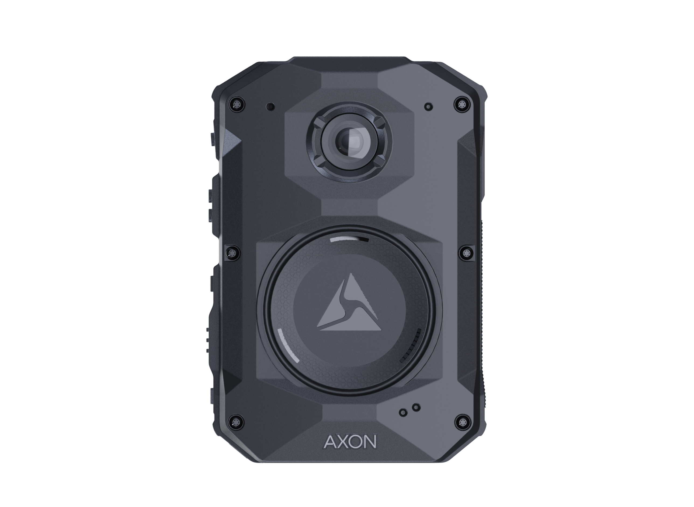

# Body-Worn Cameras and Officer Safety

Body-worn cameras have become an important piece of technology in modern law enforcement. Although they are commonly associated with accountability and evidence collection, they can also contribute to officer safety. A body-worn camera creates a visual and audio record of an encounter from the officer's general perspective. This information can later help investigators, supervisors and officers understand what occurred during an incident. 

## Documentation and Situational Awareness

One of the most important functions of a body-worn camera is documentation. Police encounters can develop quickly, and an officer may have difficulty remembering every detail after a stressful incident. Video provides another source of information that can be compared with reports, witness statements and other evidence.

### Technology Has Limitations

Body-worn camera footage should not be treated as a perfect representation of everything an officer experienced. Camera position, lighting, obstructions and field of view can affect what is recorded. A camera may capture something differently from what an officer or witness saw from another position.

Camera footage can also assist with reviewing incidents involving [[less-lethal-technology|less-lethal technology]]. This makes body-worn cameras valuable not only as recording devices but also as resources for training, documentation and evaluating police encounters.

## Axon Body 4

*Axon Body 4 body-worn camera. Image courtesy of Axon.*
